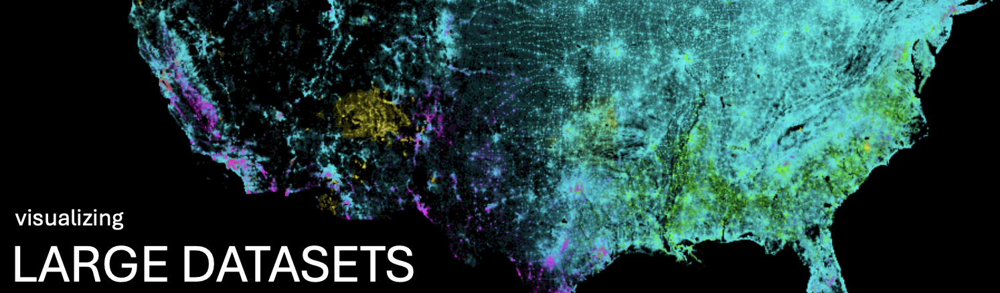

#  Analyzing and Visualizing Large Datasets

- [Lecture 1](https://github.com/musa-550-fall-2024/visualizingLargeDatasets/blob/main/Visualizing%20Large%20Data-Lec1.ipynb)
- [Lecture 2](https://github.com/musa-550-fall-2024/visualizingLargeDatasets/blob/main/Visualizing%20Large%20Data-Lec2.ipynb)

## Recommended Readings

- [Understanding the datashader algorithm](https://datashader.org/getting_started/Pipeline.html)

## New Packages

- [intake](https://intake.readthedocs.io)
- [dask](http://docs.dask.org/en/latest/)
- [datashader](http://datashader.org/index.html)
- [colorcet](https://colorcet.holoviz.org/)

## Useful Links and Reference Materials

- [Datashader User Guide](http://datashader.org/user_guide/index.html)
- [Datashader Example Use Cases](http://datashader.org/topics/index.html)
